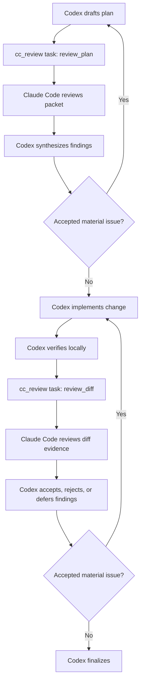

# codex-cc-reviewer

[English](README.md) | [简体中文](README.zh-CN.md)

[](https://www.npmjs.com/package/codex-cc-reviewer)
[](https://github.com/Yiyuiii/codex-cc-reviewer/actions/workflows/ci.yml)
[](LICENSE)
[](https://nodejs.org/)

Use Claude Code as a second-opinion reviewer for Codex via MCP.

**Codex builds. Claude reviews. Codex decides.**

`codex-cc-reviewer` exposes one MCP tool, `cc_review`. Codex stays the orchestrator and final decision-maker; Claude Code runs locally as a focused reviewer for plans, diffs, risky design choices, and security-sensitive changes.

Status: early pre-1.0. The core workflow is usable, but the project is still intentionally narrow.

> **⚠️ WARNING:** The default install is for trusted local repositories. It configures Claude Code with `permissionMode: "bypassPermissions"` and invokes it with `--dangerously-skip-permissions`. Do not use the default configuration directly in untrusted repositories, shared machines, or sensitive codebases. See [Safety And Configuration](#safety-and-configuration) for safer settings.

## ⚡ Quickstart

Prerequisites: Node.js 20+, npm, Codex with MCP support, and a locally authenticated Claude Code CLI. Run Claude Code once interactively before using this tool so local authentication is ready.

```bash
npm install -g codex-cc-reviewer
codex-cc-reviewer install
codex-cc-reviewer doctor
```

Restart Codex after installation, then ask Codex:

> Before implementing this feature, call `cc_review` to review the plan. After implementation, call `cc_review` again to review the diff. Treat Claude's review as advisory and tell me which findings you accept, reject, or defer.

Alternative: if you are already working inside Codex or another local coding agent, paste this exact prompt:

```text
Read this README. Then run exactly these commands:
npm install -g codex-cc-reviewer
codex-cc-reviewer install
codex-cc-reviewer doctor

Afterward, verify the MCP config changed as expected and report any files or settings you changed. Do not invent extra setup steps. Do not use sudo.
```

Maintainers validating an npm `next` prerelease can point Codex at that package explicitly:

```bash
npx --prefer-online -y codex-cc-reviewer@next --version
npx --prefer-online -y codex-cc-reviewer@next install --package-spec codex-cc-reviewer@next
npx --prefer-online -y codex-cc-reviewer@next doctor
```

After restarting Codex, `doctor` should show `codex_cc_reviewer is configured (codex-cc-reviewer@next)`.

For an automated convergence workflow where Codex calls `cc_review` at plan and diff checkpoints, see [docs/codex-usage.md](docs/codex-usage.md) and [examples/codex-global-prompt.md](examples/codex-global-prompt.md).

## 📋 Minimal Usage Examples

| Scenario | Tell Codex |
| --- | --- |
| Review before implementation | Before coding, call `cc_review` with `task: "review_plan"` and ask Claude Code to find missing steps, risky assumptions, and simpler alternatives. |
| Review the current diff | Before your final reply, call `cc_review` to review the current diff. Focus on correctness, regressions, and missing tests. |
| Security-sensitive change | Before changing auth or permissions logic, call `cc_review` for the plan and final diff. Use a conservative permission mode. |
| Docs or architecture review | Ask Claude Code to review this design document for ambiguity, unsupported assumptions, and migration risks. |
| Adversarial review | Ask Claude Code for an adversarial review of the chosen design, especially around data loss, rollback, race conditions, and reliability. |

For synthesis guidance after a review, see [docs/codex-usage.md](docs/codex-usage.md).

## 🧭 Recommended Workflow

This diagram shows the recommended convention, not a pipeline enforced by the tool. `cc_review` handles the review calls; Codex handles planning, implementation, verification, synthesis, and the final decision.



## 🆕 Latest Changes

Recent release highlights:

- `v0.3.0`: add Review Evidence Routing with risk-priority tracked diffs, selected untracked text bodies by default for diff reviews, `includeUntrackedContent`, and a `preview` CLI for inspecting packets without starting Claude Code. Keep `claude -p` as the supported review backend.
- `v0.2.3`: release assurance hardening, standard preflight checks, CI/package smoke checks, npm publish validation, and documented final `cc_review` evidence requirements.
- `v0.2.2`: `install --package-spec <spec>` support for `@next` prerelease validation and clearer `doctor` output for configured package specs.
- `v0.2.1`: branch-aware release flow with npm Trusted Publishing provenance and a validated `next` prerelease channel.
- `v0.2.0`: git evidence routing for diff reviews with changed-file manifests, routing guidance, and selected per-file diff bodies instead of one monolithic diff block.

Full history: [CHANGELOG.md](CHANGELOG.md).

## Why

- Review implementation plans before coding.
- Review diffs before final answers or commits.
- Ask for adversarial review on risky changes.
- Keep Codex in control instead of creating a broad multi-agent bridge.
- See what Claude Code did: tool activity, structured timeline events, transcript snippets, cache diagnostics, and cost.
- Send Claude Code a compact git evidence map instead of blindly stuffing every diff byte into the packet.

Proof of work: this project is roughly 99% developed and maintained by Codex itself, with Claude Code / Opus used through `cc_review` as an advisory reviewer.

## The Opus Case

This project is intentionally Opus-oriented. The default `model: "opus"` is not incidental: the bridge is meant for cases where Claude Code review is valuable enough to spend Opus-level budget. Other Claude Code models may run if you override the model, but they are not the core value proposition.

The motivating observation, as of May 2026, is specific and deliberately subjective: in the author's Claude Plan workflows, after the Opus 4.6-era Claude Code path was forced from the older roughly 200K-context working style into a 1M-context working style, Opus became much less reliable as a continuous autonomous coding agent. This failure mode was consistently reproducible in the author's long coding sessions: Opus may forget an earlier conclusion, infer code it has not read, or push toward completion before verifying the repository evidence. In the month that led to this tool, the practical symptom was more uninspected guesses and less reliable carry-over from earlier context.

That does not make Opus useless. It changes where Opus is most valuable. `codex-cc-reviewer` spends Claude Code / Opus quota on focused review work that does not need to be obeyed wholesale: challenge a plan, inspect a diff, point out missed risks, and provide review highlights. Codex keeps the task state, implements, verifies, and decides which Opus findings to accept, reject, or defer.

## Who This Is For

Use this if:

- Codex is your main implementation agent.
- You want Claude Code to act as a second reviewer, not as the primary coding agent.
- You specifically want to spend Claude Code Opus quota on review signal rather than continuous execution.
- You have seen Opus in long AI coding sessions drift, guess without reading, or rush past verification.
- You want reviews before coding, before final answers, or before commits.
- You want Codex to synthesize Claude's feedback instead of blindly accepting it.

## Not For

This is not:

- a general Claude Code and Codex bridge
- a GitHub PR review bot or CI-only reviewer
- a multi-agent debate framework
- a tool for running Claude Code as the primary implementation agent
- a safe default for untrusted repositories or shared machines
- a tool that makes Claude's review automatically authoritative

## Requirements

- Node.js 20 or newer
- npm
- Claude Code CLI `2.1.92` or newer, on `PATH`, and authenticated locally
- Codex with MCP support
- A trusted local repository, VM, or dev container

Run Claude Code once interactively before using this tool, so local authentication is ready.

## Manual Codex Config

If you prefer manual setup, add this to `~/.codex/config.toml` or a trusted project `.codex/config.toml`:

```toml
[mcp_servers.codex_cc_reviewer]
command = "npx"
args = ["-y", "codex-cc-reviewer", "serve"]
startup_timeout_sec = 20
tool_timeout_sec = 900
required = false
enabled = true
enabled_tools = ["cc_review"]
```

Restart Codex after changing MCP configuration. See [docs/manual-setup.md](docs/manual-setup.md) for the standalone setup note.

The installer also accepts `--package-spec <spec>` for prerelease testing:

```bash
codex-cc-reviewer install --package-spec codex-cc-reviewer@next
```

<a id="safety-and-configuration"></a>

## Safety And Configuration

The default mode is intentionally powerful. This package is tuned for a trusted local owner workflow.

| Setting | Default | Role | Risk | Recommendation |
| --- | --- | --- | --- | --- |
| `model` | `opus` | Spend Claude Code / Opus budget on high-signal review. | Higher cost than smaller models. | Keep for high-value review; override only when cost or latency matters more than review depth. |
| `effort` | `max` | Push Claude Code toward deeper review. | Slower and more expensive. | Keep for release, security, architecture, and complex diff review. |
| `permissionMode` | `bypassPermissions` | Skip Claude Code's permission gate so the configured tool allowlist can run unattended. | High risk: passes `--dangerously-skip-permissions`. | Use only in repositories, VMs, dev containers, or local workspaces you control. |
| `tools` | `["default"]` | Select Claude Code's tool allowlist; MCP accepts JSON arrays, and the local CLI also accepts comma-separated strings. | May broaden what the reviewer can inspect or execute. | Use `["Read", "Grep", "Glob"]` for conservative read-only review. |
| `redactSecrets` | `false` | Preserve review evidence faithfully. | Sensitive content can be included in packets. | Set `true` for sensitive or shared repositories; treat it as best-effort only. |
| `includeUntrackedContent` | default-on for `review_diff` and `adversarial_review` | Include selected untracked text bodies in diff-oriented packets. | New local text files can be sent to Claude Code. | Set `false` when you only want untracked paths listed. |
| `stream` | `true` | Capture stream-json activity, transcript, diagnostics, and cost when reported. | More verbose output. | Keep enabled unless debugging a client that cannot handle streamed output. |
| `cacheTtl` | `1h` | Hint Claude Code to use the 1-hour prompt cache when available. | Cache reporting can be cold or unavailable. | Keep default; inspect cache diagnostics instead of assuming cache hits. |
| `maxContextChars` | `120000` | Bound variable review packet blocks. | Larger packets can include more local content and cost more. | Lower for narrow reviews; keep default for high-value diff evidence. |

These are example configurations, not built-in profile names:

| Use case | Suggested fields | Notes |
| --- | --- | --- |
| Trusted local owner workflow | `permissionMode: "bypassPermissions"`, `tools: ["default"]`, `redactSecrets: false` | Full-fidelity local workflow for your own repo, VM, or dev container. |
| Conservative review | `permissionMode: "plan"` or `"default"`, `tools: ["Read", "Grep", "Glob"]`, `redactSecrets: true` | Use for sensitive or shared repositories where review should stay read-only. |
| Large-context review | default settings, optionally higher `maxContextChars` | Review packets use a large context budget and preserve both the beginning and end of oversized blocks. |

Review packets are sent as faithfully as possible by default. `redactSecrets: true` enables best-effort redaction, but it is not comprehensive and can remove useful evidence.

`cc_review` does not expose cost or turn caps. Timeout remains enabled as service hang protection, not as a model capability limit.

Oversized packet blocks are truncated from the middle, keeping both the start and the end. This preserves framing and recent evidence while avoiding unbounded packet growth.

### Git Context Routing

For `review_diff` and `adversarial_review`, Review Evidence Routing sends higher-value evidence before lower-value evidence when the packet budget is constrained. The packet includes:

- `Git Evidence Summary`: diff stat, name-status, and untracked file manifest.
- `Changed Files Manifest`: file, status, inclusion (`full`, `partial`, `omitted`), changed line counts, and routing reason.
- `Context Routing Guidance`: tells Claude Code when to inspect partial or omitted files with its own tools.
- `Routed Git Diff Evidence`: selected per-file diff bodies.
- `Untracked Files Manifest` and `Routed Untracked File Evidence`: selected untracked text files for diff-oriented reviews.

Tracked diffs are routed by risk before budget is consumed: MCP transport, runner, packet/schema/config, release/install workflow, and security/config changes are prioritized over routine source, tests, docs, and generated output. Generated paths, lockfiles, dist/build output, dependency/vendor/cache output, minified assets, and binary/null-byte files are listed in manifests but omitted from embedded bodies by default.

Untracked text content is embedded by default for `review_diff` and `adversarial_review` when git auto-discovery is enabled, and untracked candidates are also prioritized before their body budget is consumed. `review_plan` and `review_doc` keep untracked files summary-only unless `includeUntrackedContent` is explicitly `true`. Sensitive-looking filenames are not blocked by name alone; use `redactSecrets: true` for best-effort content redaction.

See [docs/security.md](docs/security.md) for the full security note.

## Direct Tool Input

The MCP server exposes one tool: `cc_review`.

```json
{
  "task": "review_diff",
  "originalGoal": "Add a safer release flow.",
  "reviewFocus": "Look for correctness, regressions, and missed tests.",
  "codexSummary": "Updated release docs and package metadata.",
  "testsRun": ["npm test: passed"],
  "context": "Review the current change."
}
```

The tool automatically includes a lightweight Git Evidence Summary when git discovery is enabled: diff stat, name-status, and untracked file manifest. For `review_diff` and `adversarial_review`, it also collects raw git status, `git diff HEAD`, and selected untracked text file bodies by default unless disabled; tracked and untracked evidence are routed into separate manifests plus selected body evidence. Set `includeUntrackedContent: false` to keep untracked files path-only. `prompt` remains accepted as a backward-compatible alias for `reviewFocus`.

Local CLI test with an optional review focus:

```bash
codex-cc-reviewer review --task review_plan --review-focus "Review the plan" --context "..."
```

Preview the packet without invoking Claude Code:

```bash
codex-cc-reviewer preview --task review_diff --context "Preview the current packet"
```

See [docs/tool-contract.md](docs/tool-contract.md) for all input and output fields.

## What Codex Receives Back

The final MCP result includes Claude's review text, recent Claude Code activity events, a structured activity timeline, recent transcript snippets, prompt cache token counts and effective cache status when reported, diagnostics, and cost when reported.

Shortened example:

```json
{
  "ok": true,
  "task": "review_diff",
  "model": "opus",
  "elapsedMs": 42100,
  "review": "The main risk is ...",
  "command": ["claude", "-p", "Review the packet provided on stdin.", "..."],
  "eventsTail": ["tool_use: Read {\"file_path\":\"README.md\"}", "result"],
  "activityTail": [
    {
      "index": 12,
      "kind": "tool_use",
      "rawType": "assistant",
      "summary": "Read README.md",
      "toolName": "Read"
    }
  ],
  "transcriptTail": ["Claude inspected the diff and focused on correctness."],
  "eventCount": 128,
  "cache": {
    "inputTokens": 42,
    "creationInputTokens": 1234,
    "readInputTokens": 5678,
    "cacheCreation": {
      "ephemeral1hInputTokens": 1234
    },
    "effective": "hit"
  },
  "diagnostics": ["MCP progress unavailable: request did not include _meta.progressToken."],
  "costUsd": 0.42,
  "exitCode": 0
}
```

While Claude Code runs, the MCP server also sends `notifications/progress` when the Codex MCP client provides a `progressToken`. If the client does not provide one, the final detail still includes the captured timeline and a diagnostic explains why real-time progress was unavailable.

## Troubleshooting

Run:

```bash
codex-cc-reviewer doctor
```

Common issues:

- `claude` is not found: install Claude Code and make sure it is on `PATH`.
- Claude is not authenticated: run Claude Code interactively once and complete auth.
- Codex config is missing: run `codex-cc-reviewer install`.
- Codex does not show the tool: restart Codex after changing MCP config.
- Reviews time out: increase `tool_timeout_sec` in Codex config.
- `doctor` warns about Claude Code daemon or blocked background jobs: run `claude agents` and stop stale sessions with `claude stop <id>` before debugging review failures.
- Codex only shows one tool call while Claude Code is running: real-time progress requires the Codex MCP client to send `_meta.progressToken`. If it does not, check the final `diagnostics` and `activityTail` fields instead.
- Cache reads stay at zero: the first run may be a cold cache write, Claude Code may not have reported usage, or the prompt may be below the model's minimum cacheable length.
- `cache.inputTokens` is Claude Code's reported residual uncached input tokens, not total input tokens. `cache.effective: "disabled"` means this request did not ask for the 1-hour cache hint; inspect raw cache fields because Claude Code can still report 1-hour or 5-minute cache activity.

See [docs/troubleshooting.md](docs/troubleshooting.md) for the full troubleshooting guide.

## Maintainer Research

The product path intentionally uses Claude Code print mode (`claude -p`) because it returns a structured result directly. Claude Code background sessions / Agent View are useful to study, but currently require internal job/transcript files for full-result recovery and have a less stable status surface.

Maintainers can run a local A/B smoke after authenticating an isolated Claude profile:

```bash
npm run research:bg-ab -- --profile-dir ~/.claude-plan
```

Maintainers can also run repeat-call cache research for `claude -p` without changing packet routing:

```bash
npm run research:cache-repeat -- --runs 2 --stable-location stdin --dynamic-mode suffix
codex-cc-reviewer preview --task review_diff --context "Cache experiment" > packet.md
npm run research:cache-repeat -- --packet-file packet.md --dynamic-mode same
```

The cache-repeat harness sends packet-file content through stdin, never argv, and its JSON summary omits prompt, packet, stdin, and stderr content. It is directional evidence for repeated-call cache behavior, not a byte-equivalent replay of `cc_review`. Packet-file experiment cost scales with packet size times run count; start with a small or medium preview packet before running larger reviews. Packet reorder remains unimplemented until this evidence shows it can materially help repeated-call cost. Real npm publication still happens through `.github/workflows/release.yml` via Trusted Publishing when a version tag is pushed; local npm commands are verification only.

This script is not part of the MCP tool contract and should not be treated as a supported backend.

## How Is This Different?

`codex-cc-reviewer` is intentionally narrow. It is about bringing Claude Code review into a local Codex workflow, not replacing either tool.

| Project style | Typical direction | This project |
| --- | --- | --- |
| Claude Code plugin for Codex | Claude Code calls Codex | Codex calls Claude Code |
| PR review bots | GitHub PR events trigger review | Local Codex workflow triggers review |
| Multi-agent loops | Agents debate or iterate automatically | Claude reviews once; Codex synthesizes |
| Broad bridges | Many tools and bidirectional delegation | One MCP tool: `cc_review` |

See [docs/prior-art.md](docs/prior-art.md) for related work and scope boundaries.

## Documentation

- [Repository agent instructions](AGENTS.md): maintenance workflow, review gates, and release promotion rules.
- [Installation](docs/installation.md): install commands and requirements.
- [Manual setup](docs/manual-setup.md): Codex MCP config snippet.
- [Codex usage](docs/codex-usage.md): when to call `cc_review` and how to synthesize feedback.
- [Tool contract](docs/tool-contract.md): complete MCP input and output fields.
- [Security](docs/security.md): default permission posture and safer settings.
- [Troubleshooting](docs/troubleshooting.md): common setup problems.
- [Prior art](docs/prior-art.md): related workflows and project scope.
- [Examples](examples): sample Codex config, AGENTS guidance, synthesis packet, and global prompt.
- [Changelog](CHANGELOG.md): release notes.
- [Security policy](SECURITY.md): vulnerability reporting scope.

## Contributing

Contributions are welcome when they keep the project narrow: better prompts, safer defaults, install support, Claude CLI parsing, tests, and docs.

See [CONTRIBUTING.md](CONTRIBUTING.md).

## License

[MIT](LICENSE)
